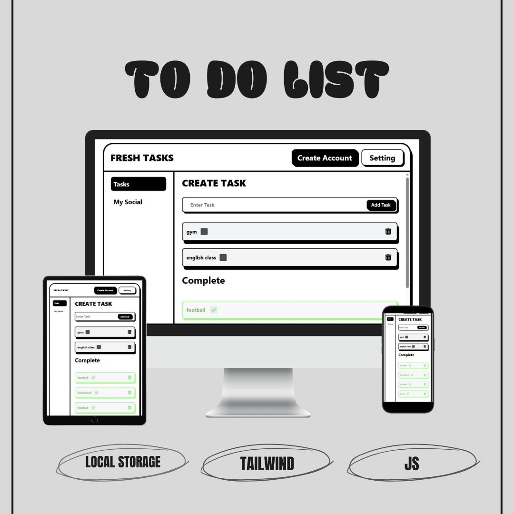
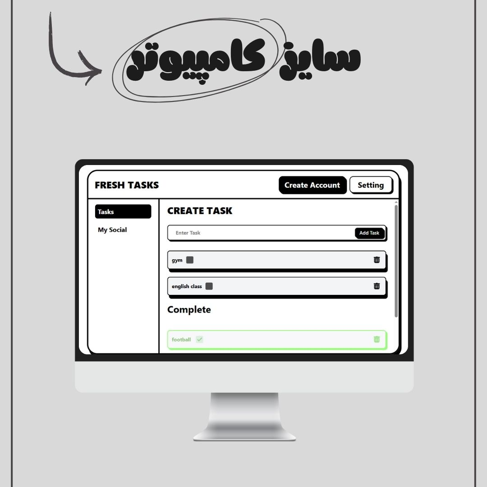
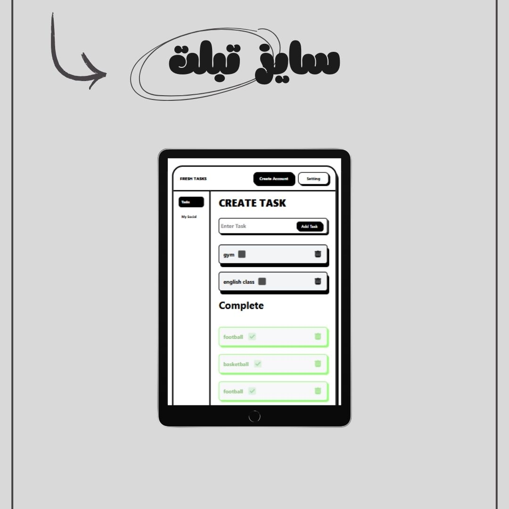

# ✅ Fresh Tasks – Advanced To-Do List App

Fresh Tasks is a **modern, responsive To-Do List application** built with **HTML5, CSS3, Tailwind CSS, and Vanilla JavaScript**.  
It works like a real app thanks to **Local Storage**, meaning your tasks stay saved even after refreshing or closing the browser.

This project helped me deeply understand how **Local Storage** works and how to build a snappy, app-like UX for web.

---

## ✨ Features
- 📝 Add, complete, and manage daily tasks
- ✅ Mark tasks as completed (moves them to "Completed" section)
- ❌ Delete tasks (sent to "Trash")
- 💾 Persistent storage with **Local Storage**
- 📱 Fully responsive design for desktop, tablet and mobile

---

## 📅 Project Date
**September 19, 2025 | ۲۸ شهریور ۱۴۰۴**

---

## 🔗 Live Demo
👉 [Try Fresh Tasks](https://parsa-farshah.github.io/toDoListLocalStorage/)

---

## 👨‍💻 Developed By
**Parsa Dehghan Pour Farashah**

## 🔧 Project Mentor
[@parsa_ghorbanian_web](https://www.instagram.com/parsa_ghorbanian_web)

---

## 📲 Connect with Me
- 📸 Instagram: [@parsa_dehghanpour_dv](https://www.instagram.com/parsa_dehghanpour_dv?igsh=eHkwNWhsa3I4ZWVp)  
- 💼 LinkedIn: [Parsa Dehghan Pour Farashah](http://linkedin.com/in/parsa-dehghan-pour-farashah-85ab04250)  
- 💻 GitHub: [parsa-farshah](http://github.com/parsa-farashah)  
- 📩 Email: parsafarashah2002@gmail.com  
- 📺 YouTube: [@FrontEndFresh](https://youtube.com/@frontendfresh?si=-2WsIYe-KBTUfwyu)  
- 💡 CodePen: [@parsa-dehghan](https://codepen.io/parsa-dehghan)

---

## 📸 Project Screenshots

### 🌟 Overview

### 💻 Desktop View

### 📱 Tablet View

### 📱 Mobile View

